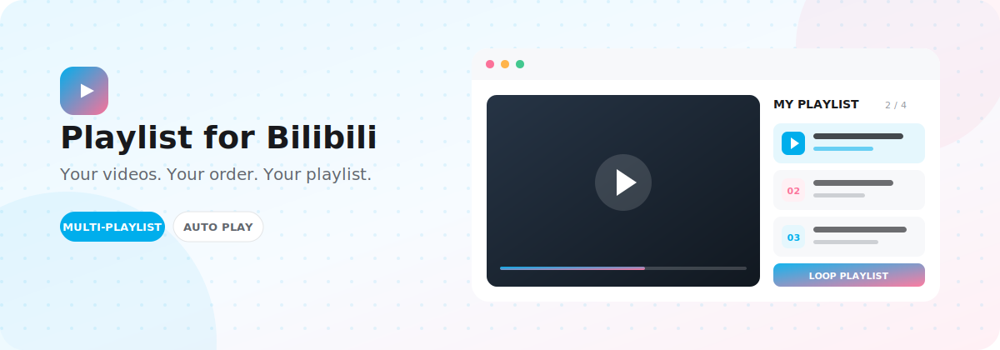
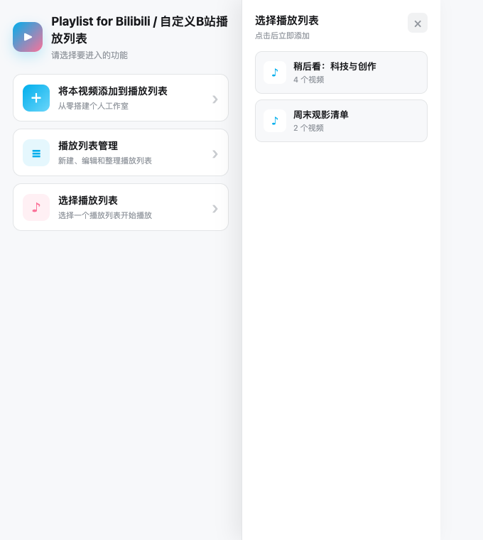
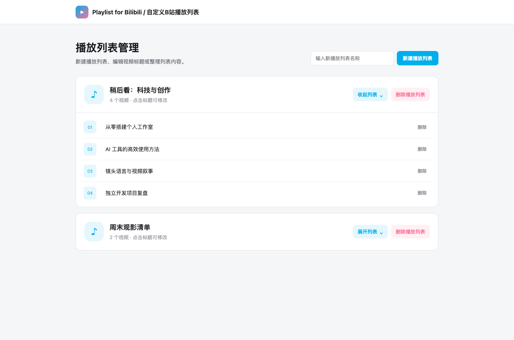
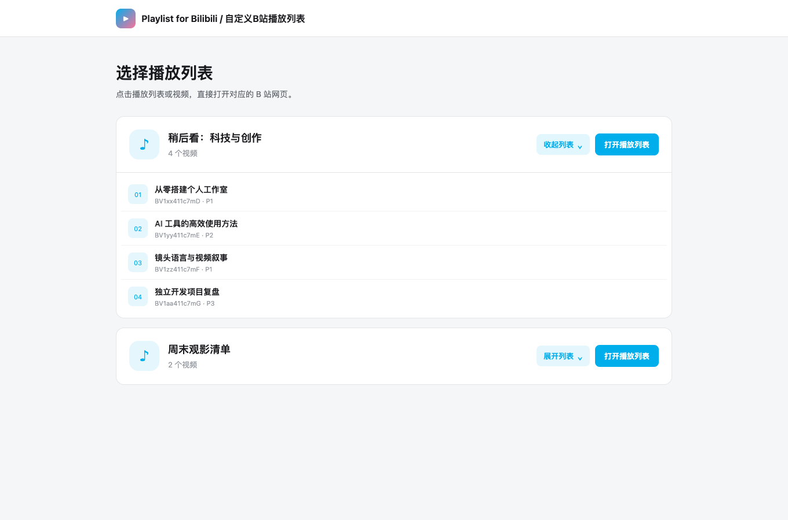
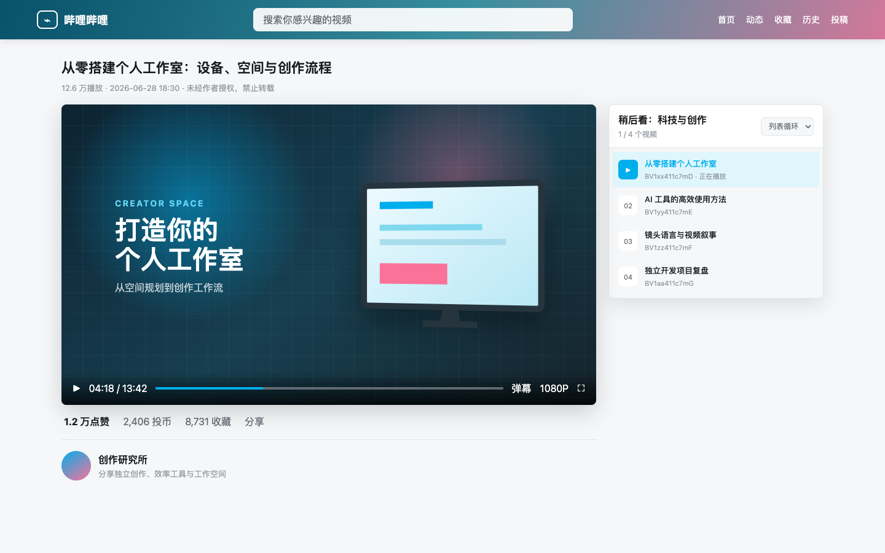

# Playlist for Bilibili

**在 B 站创建真正属于你的播放列表**

收藏、整理并按照喜欢的方式连续播放视频。

[](https://github.com/cqguo/playlist-for-bilibili/releases/latest)


[下载扩展](https://github.com/cqguo/playlist-for-bilibili/releases/latest) · [核心功能](#核心功能) · [安装指南](#安装指南) · [使用手册](#使用手册) · [常见问题](#常见问题)

---

## 项目简介

Playlist for Bilibili 是一款轻量的 Chrome 扩展，为 B 站补充自定义播放列表能力。你可以把普通视频或分 P 视频收藏到不同列表中，自由调整播放入口，并使用顺序、循环、单曲循环或随机模式连续播放。

> 播放列表只保存在当前浏览器的扩展存储中，不上传服务器，也不会自动同步到其他设备。

## 核心功能

| 播放列表管理 | 连续播放 |
| --- | --- |
| 创建、删除多个独立播放列表 | 视频结束后自动切换下一项 |
| 收藏当前视频，自动识别 BV 号与分 P | 支持顺序、列表循环、单曲循环和随机播放 |
| 编辑视频标题，移除不需要的项目 | 从列表中任意视频开始播放 |
| 单个列表最多保存 500 个视频 | 每个列表独立记忆播放模式 |

### 使用流程

```text
打开 B 站视频  ->  收藏到播放列表  ->  整理与选择列表  ->  开始连续播放
```

扩展菜单提供三个清晰入口：

| 入口 | 用途 |
| --- | --- |
| 将本视频添加到播放列表 | 收藏当前打开的 B 站视频或指定分 P |
| 播放列表管理 | 新建列表、修改标题、删除视频或列表 |
| 选择播放列表 | 预览列表内容，并从第一项或任意一项开始播放 |

## 应用截图

以下截图来自扩展的真实界面，用来快速了解主要功能。

| 弹窗入口 | 播放列表管理 | 选择播放列表 |
| --- | --- | --- |
|  |  |  |

点击浏览器工具栏中的插件图标即可打开左侧弹窗，直接进入三个核心功能；管理页用于新建和整理列表；选择页则适合预览内容并一键打开播放。

### 视频页播放效果



从播放列表打开视频后，扩展会在播放器右侧展示当前列表。正在播放的视频会高亮显示，也可以直接切换视频或调整播放模式。

## 安装指南

### 从 Release 安装

1. 前往 [Releases 页面](https://github.com/cqguo/playlist-for-bilibili/releases/latest) 下载最新的 ZIP 扩展包。
2. 解压下载的文件。
3. 在 Chrome 地址栏打开 `chrome://extensions/`。
4. 开启右上角的“开发者模式”。
5. 点击“加载已解压的扩展程序”，选择解压后的文件夹。
6. 将扩展固定到浏览器工具栏，即可开始使用。

### 从源码安装

```bash
git clone https://github.com/cqguo/playlist-for-bilibili.git
```

然后在 `chrome://extensions/` 中选择“加载已解压的扩展程序”，并指向项目根目录。

> 更新项目代码后，需要在扩展程序管理页面点击“重新加载”，并刷新已经打开的 B 站页面。

## 使用手册

### 1. 创建播放列表

1. 点击浏览器工具栏中的插件图标，打开扩展菜单。
2. 选择“播放列表管理”。
3. 输入播放列表名称。
4. 点击“新建播放列表”。

播放列表名称不能为空，最长为 80 个字符。首次使用时，扩展也会自动创建一个空的“默认播放列表”。

### 2. 收藏当前视频

1. 打开需要收藏的 B 站视频页面。
2. 如果是分 P 视频，请先切换到需要收藏的分 P。
3. 点击浏览器工具栏中的插件图标，打开扩展菜单。
4. 点击“将本视频添加到播放列表”。
5. 选择目标播放列表。

同一“BV 号 + 分 P”不会重复添加。如果页面标题发生变化，再次添加时会更新已保存的标题。

### 3. 管理列表内容

- 点击“展开列表”查看全部视频。
- 点击视频标题进入编辑状态。
- 按 `Enter` 或点击“✓”保存标题。
- 按 `Esc` 或点击“×”取消修改。
- 点击视频右侧的“删除”将其移出列表。
- 点击“删除播放列表”删除整个列表及其内容。

删除前浏览器会显示确认提示，操作完成后无法自动恢复。

### 4. 选择并打开播放列表

1. 打开扩展菜单，选择“选择播放列表”。
2. 点击“展开列表”预览视频。
3. 点击任意视频，从该项目开始播放。
4. 或点击“打开播放列表”，从列表第一项开始播放。

空播放列表无法开始播放，需要先添加至少一个视频。

### 5. 使用视频页播放列表

从“选择播放列表”页面打开视频后，B 站视频页右侧会显示当前播放列表：

- 当前视频以高亮状态显示。
- 点击列表中的视频可以立即切换项目。
- 标题下方会显示 BV 号和播放状态。
- 页面顶部会显示当前位置和视频总数。
- 视频结束后会按照当前模式继续播放。

直接打开普通 B 站视频链接时，不会启用扩展的播放列表模式。

## 播放模式

| 模式 | 播放行为 |
| --- | --- |
| 顺序播放 | 按列表顺序播放，最后一个视频结束后停止 |
| 列表循环 | 最后一个视频结束后返回第一项 |
| 单曲循环 | 当前视频结束后重新播放当前项目 |
| 随机播放 | 当前视频结束后随机选择其他项目 |

每个播放列表的播放模式会独立保存，下次打开同一列表时继续使用。

## 数据与隐私

- 播放列表、视频标题和播放模式保存在 Chrome 本地扩展存储中。
- 关闭浏览器后数据仍会保留。
- 数据不会上传服务器，也不会自动同步到其他浏览器或设备。
- 当前版本暂不提供导入、导出或云端备份功能。
- 卸载扩展或清除扩展数据可能导致播放列表丢失。

## 常见问题

### 无法添加当前视频

请确认当前页面是 `www.bilibili.com/video/` 下的正常视频页面，然后刷新页面并重新打开扩展。

### 修改代码后页面没有变化

请在 `chrome://extensions/` 中重新加载扩展，再刷新 B 站页面。已经打开的页面可能仍在运行旧版内容脚本。

### 播放列表没有显示

请确认视频是从“选择播放列表”页面打开的，并检查地址栏链接中是否包含 `bili_playlist=1`。

### 视频没有自动切换

请确认视频已正常播放到结束，并检查当前播放模式。顺序播放模式在最后一个视频结束后会停止。

### 本地数据读取异常

先重新加载扩展并刷新页面。如果问题仍然存在，请谨慎清除扩展数据；清除后已有播放列表将无法恢复。

## 项目结构

```text
.
├── css/          # 扩展页面与弹窗样式
├── docs/         # README 视觉素材与截图
├── js/           # 播放列表、页面交互与内容脚本
├── pages/        # 弹窗、管理页与选择页
├── manifest.json
└── README.md
```

---

Made for a smoother Bilibili watching experience.
